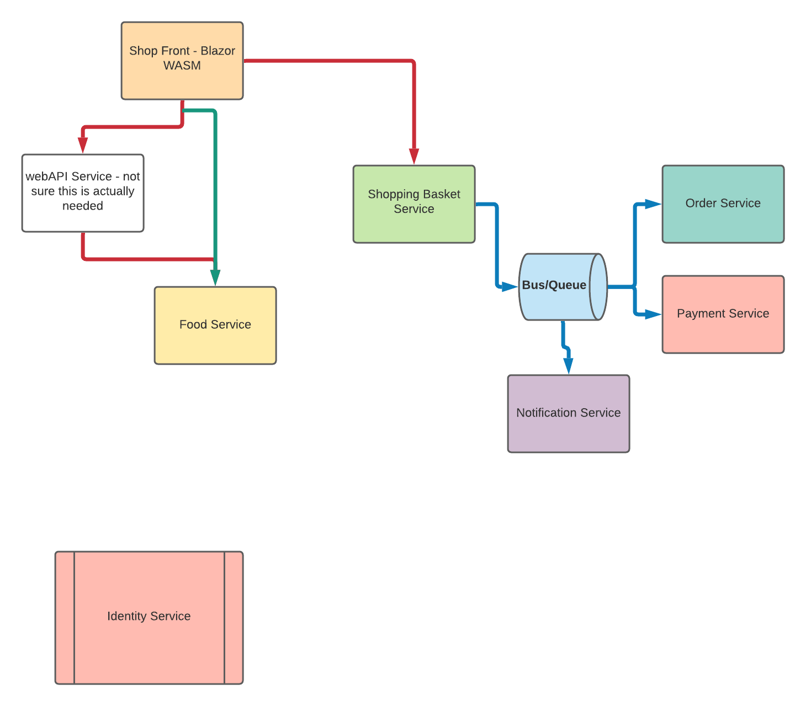

# Welcome to Tacky Tacos Workshop

Layla is currently building this application on [Twitch](https://twitch.tv/laylacodesit).

This project is built using a microservices architecture.

The current architecture looks like this.

Run Eureka from Docker: docker run -p 8761:8761 steeltoeoss/eureka-server

Run Rabbit MQ from Docker: docker run --rm -it --hostname my-rabbit -p 15672:15672 -p 5672:5672 rabbitmq:3-management
